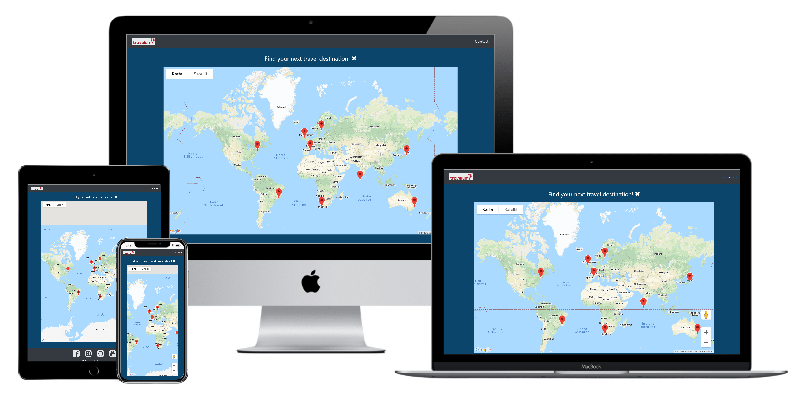

# TRAVELUM 

:airplane:
Visit the live website: [Travelum](https://sebastian-torres-matrix.github.io/Travelum/)

## Introduction 
Welcome to Travelum! :crossed_flags: 
Our goal is to keep it simple and offer wonderful travels to the most popular destinations around the world! It is for all people who loves to travel, everything from families, couples, friends and solo travelers. Our target group is mainly aimed towards travelers who have busy lives or just likes to be productive. So we make it simple with few destinations, visual information and suggestions on activities, foods to eat and places to visit on each destination. If you have any further questions, just fill the contact form and we will get in touch asap. If you want more inspiration and information of each destination, visit our social media channels for more images and videos. Happy traveling! :sunglasses:
 
## Table of Contents
1. [UX](#ux)
    * [Project Goals](#project-goals)
    * [User Stories](#user-stories)
    * [Design Choices](#design-choices)
    * [Wireframes](#wireframes)
2. [Features](#features)
    * [Existing Features](#existing-features)
    * [Features Left to Implement](#features-left-to-implement)
3. [Technologies Used](#technologies-used)
    * [Tools](#tools)

4. [Testing](#testing)

5. [Deployment](#deployment)

6. [Credits](#credits)
    * [Content](#content)
    * [Media](#media)
    * [Acknowledgements](#acknowledgements)

7. [Disclaimer](#disclaimer)

## UX 

#### Project Goals 
:dart: 
-	Make it easy and quick to make decisions on travel destinations.
-	Give travelers visual information and tips, on activities and food for the offered destinations.
-	Be able to have contact and answer questions through our contact form.
-	Give more visual information on the destinations with images and videos, through our social media channels.

#### User Stories 
:clapper: 
-	As a user I want a website that in a easy, visual and informative way, that can help me find my next holiday destination.
-	As a user I want to be able to contact the support, if I have further questions.
-	As I potential buyer I want to be able to gather more information through social media connected to the company.
-	As David, I want to have a visual map overview of the destinations offered by the company.
-	As Maria, I want to see engaging images/videos for each destination.
-	As Jacob, I want to be able to interact on all my devices. On my laptop, iPad and smartphone.
-	As Jennifer, I prefer fewer quality destination choices, instead of too much to choose from.
-	As Bruno, I want a lean and easy website to navigate through.
-	As Daniela, I want some facts and short information for each destination.
-	As Julia I want to be able to choose from destinations in different continents, all over the world.
-	As John I would like to see different activities that are possible to do in each destination.
-	As Richard I want some visual information of local foods that each destination offers.
-	As Jake I want to be able to visit and see different landmarks on each destination.


> “*As a busy worker, husband and dad of four children, when I have vacations I want it to be fast and easy, when looking for travel destinations, preferably with suggestions on activities, things to see and places to eat in the travel destination. So I can be productive with my free time and make quick decisions, so I can spend more time with the ones that matter most, my family.*”  
/ **Seth** :man:


> “*As a couple, me and my girlfriend want to be able to choose from different popular destinations around the world. We use social media frequently and would love to see visual images from the different destinations, to make the best decision, based on concrete information. Also we love food and always try different locals food!*” 
/ **Johnny and Lisa** :couple:


> “*When choosing the right website when purschasing my travels. I like it to be lean and clean. Not to many choices, which leads me to procrastinate. I use different technical devices and it is important for me that the website runs smoothly on all my devices. Also, if I feel insecure or have further questions, I would like to be able to contact the support team.*”  
/ **Emelie** :woman:

#### Design Choices
:art:

#### Wireframes
The wireframes were created using [Balsamiq](https://balsamiq.com/).
- Here is the link to see the [Wireframes](https://github.com/Sebastian-Torres-Matrix/Travelum/tree/master/wireframes)

## Features 
:mag_right:

#### Existing Features
-	Interactive navigation bar. Allows users to navigate to top of the site through navbar brand and also navigate to the contact page through contact link.
-	Interactive footer. Allows user to check out our social media channels through external icon links with target="blank".
-	Marker drop. For UX when user arrives to landing page or reloads landing page.
-	Marker information. Allows user to get some facts about targeted destination when clicking on desired marker.
-	Onclick function on markers. Allows users to see images and videos with landmarks, activities and foods, for the destination.
-	Contact form. Allows users to ask questions and have contact with the support team.
-	Responsive for all devices. Allows users to interact with the website with different devices, as laptop, iPad and smartphone.

#### Features Left to Implement
-	Zoom function on each marker, that zooms in the destination when clicking on it.
-	Bounce marker. When clicking on a marker, the chosen marker bounces for better UX.  
-	FAQ. A section that answers some of the most common questions asked by users.
-	Order page. A section that allows the user to make the payment for the chosen order.

## Technologies Used 
:computer: 

#### Languages
* HTML
* CSS 
* JavaScript 

#### Libaries & Frameworks
* [Bootstrap](https://getbootstrap.com/) 
* [EmailJS](https://www.emailjs.com/)  
* [FontAwesome](https://fontawesome.com/) 
* [Google Maps API](https://developers.google.com/maps/documentation) 
* [JQuery](https://jquery.com/) 

#### Tools 
:wrench:
* [Balsamiq](https://balsamiq.com/) 
* [Brandbucket](https://www.brandbucket.com/) 
* [Chrome DevTools](https://developers.google.com/web/tools/chrome-devtools) 
* [Git](https://git-scm.com/) 
* [Github](https://github.com/) 
* [Gitpod](https://www.gitpod.io/) 
* [Multi Device Website Mockup Generator](https://techsini.com/multi-mockup/) 

## Testing
:electric_plug:

* [W3C Markup Validation](https://validator.w3.org/)
    - Was used to check HTML5 validation.
* [W3C CSS Validation](https://jigsaw.w3.org/css-validator/#validate_by_input)
    - Was used to check CSS3 validation.
* [JShint](https://jshint.com/)
    - Was used to check Javascript validation.
* [AutoPrefixer](https://autoprefixer.github.io/)
    - Was used to make sure that CSS3 was valid for all web browsers.
* [Google Chrome](https://www.google.com/intl/sv/chrome/)
    - Was used to test the web browser.
* [Chrome DevTools](https://developers.google.com/web/tools/chrome-devtools)
    - Was used to test the responsive design for different devices. 

#### User Stories Testing
1. As __David__, I want to have a visual map overview of the destinations offered by the company.
    - A map is applied on the landing page and works as intended.
2. As __Maria__, I want to see engaging images/videos for each destination.
    - Engaging images are applied for each destination. 
3. As __Jacob__, I want to be able to interact on all my devices. On my laptop, iPad and smartphone.
    - Responsive design has been tested, to make sure that the website works well on all devices.
4. As __John__ I would like to see different activities that are possible to do in each destination.
    - We have now applied images with different activity suggestions to do on each destination.
5. As __Richard__ I want some visual information of local foods that each destination offers.
    - We have now applied images with different local food suggestions to try for each destination.
6. As __Jake__ I want to be able to visit and see different landmarks on each destination.
    - We have now applied images with different landmark suggestions to visit for each destination.

#### Manual Testing

1. __Navbar__
    1. Ensure that the logo icon and contact link loads correctly.      
    2. Ensure positioning works properly.
    3. Ensure that navbar is fixed when scrolling down.
    4. Click on logo.
    5. Ensure that logo work and takes you to start position when clicking.
    6. Click on contact link.
    7. Ensure links works properly and takes you to the contact page.

1. __Map__
    1. Ensure that markers drop for each destination, when page is loaded.
    2. Click on a marker/destination.
    3. Ensure that info window pops up with content and image.
    4. Click on the link/button on the info window.
    5. Ensure that the link works and takes you to the correct page.
    6. Ensure that the button loads images when clicking the button/link.

1. __Videos__
    1. Ensure that videos loads.
    2. Ensure that video shadow works.
    3. Ensure that correct position is coded.
    4. Ensure that videos works on all devices.
    5. Ensure that responsive design works.

1. __Social Media Icons__
    1. Ensure that icons loads correctly.
    2. Ensure that positioning worked properly.
    3. Ensure that hover works.
    4. Click on icons.
    5. Ensure links works properly and opened in a new tab for each icon. 

1. __Contact form__
    1. Go to the "Contact" page.
    2. Try to submit the empty form and verify that an error message about the required fields appears.
    3. Try to submit the form with an invalid email address and verify that a relevant error message appears.
    4. Try to submit the form with all inputs valid and verify that message has been sent.

1. __Chrome__
    1. Test that website works on Chrome web browser.

1. __Responsiveness__
    1. Use Bootstrap for a responsive website.
    2. Test the different breakpoints.
    3. Test regularly with DevTools to make sure that pages are responsive, on all devices.

#### Bugs
1. __Markers__
    - Did not show info window with content, when clicking.
    - Solution: Added a event.addListener with a function.

2. __Drop Markers__
    - Markers did not drop when loading landing page.
    - Solution: Figured out how the iteration with the for loop worked.

3. __One marker responsive__
    - Only New York marker worked as intended.
    - All markers suppose to load images of the destination, when clicking on the link, in the info window.
    - Tried many different ways, many hours of googling and Youtube-videos to learn and find the solution.
    - I was no able to solve the problem and making the different coding approaches to work. 
    - At the end closing in on the deadline on the project, I chose to connect the links/destinations to .html files instead.
    ``` 
    function displayDestination() {
        let myLocation = document.getElementById("myCountry");
        if (myLocation.style.display === "none") {
          myLocation.style.display = "block";
        } else {
          myLocation.style.display = "none";
        }
      } 
      
      <a href="javascript:;" onclick="displayDestination()">New York</a><br>
      
      ```
      ``` 
      	<section class="container-fluid text-center" id="myCountry">
		<div class="row">
			<div class="col-12">
            <!-- page headline -->
				<h1 class="video-gallery-headline text-center">NEW YORK</h1>
				
			</div>
            <!-- videos gallery -->
				<div class="col-sm-12 col-md-4">
					<h2>LANDMARKS <i class="fa fa-binoculars" aria-hidden="true"></i></h2>
					<iframe class="videos-gallery" src="https://www.youtube.com/embed/9QM0tipFQ9c"
						allowfullscreen></iframe>
				</div>
				<div class="col-sm-12 col-md-4">
					<h2>ACTIVITIES <i class="fa fa-bicycle" aria-hidden="true"></i></h2>
					<iframe class="videos-gallery" src="https://www.youtube.com/embed/1JJfWnAryrM"
						allowfullscreen></iframe>
				</div>
				<div class="col-sm-12 col-md-4">
					<h2>FOOD <i class="fa fa-cutlery" aria-hidden="true"></i></h2>
					<iframe class="videos-gallery" src="https://www.youtube.com/embed/YvPqrwGDgnM"
						allowfullscreen></iframe>
				</div>
			</div>
	</section>

4. __Contact alignment__
    - Did not align to the right. Kept to the left next to brand logo.
    - Solution: added BootsTap “mr-auto” class.

5. __Form/E-mail__
    - Did not work when testing to “Send”.
    - Solution: Added “response” and “error” as parameters to functions.

6. __Fontawesome icons__
    - Some of the Icons from Font Awesome did not work as intended. 
    - Realized that the icons were from different versions of Font Awesome. 
    - Solution: find all icons that was responsive for the applied Font Awesome CDN version. 

7. __Google Maps API__
    - API did not load and was not working.
    - Realized that there are different API keys for different maps.
    - Soultuion: Found the correct API key that worked for the chosen map.

8. __Loading map laging__
    - Map was lagging when loading page.
    - Had the “script src” at the top.
    - Solution: erased async/defer and put the “script src” at the bottom.

9. __Responsive Design__
    - Responsive design was not working on all devices.
    - Solution: Added media queries in css. 

## Deployment
:rocket:
The project was created by using the IDE services of [Gitpod](https://www.gitpod.io/), from Gitpod the project was committed to Git and pushed to Github from the master branch.

This process was taken to deploy the website, from Github repositories:
1. You can log into [Github Pages](https://pages.github.com/)
2. From the repositories shown, choose: Sebastian-Torres-Matrix/Travelum.
3. On the menu bar at the top, to the right you can click on __Settings__.
4. From there you can scroll down to the section __Github Pages__.
5. On the headline __Source__ you can choose __master branch__, from the dropdown menu.
6. When choosing __master branch__, the master branch is deployed and also up to date: with access to the link to: [Travelum](https://sebastian-torres-matrix.github.io/Travelum/)
7. During the project, it has always been the master branch that has been deployed to Github Pages.

If you want to run this project locally, you can clone this repository from Gitbuh Pages by following this steps:
1. Use this link to get to the Github repository: https://github.com/Sebastian-Torres-Matrix/Travelum .
2. On the menu bar at the top, to the right, choose the green button named __Clone or download__.
3. In the __Clone with HTTPS__, you can copy the __web URL__.
4. Open __Git bash__, in your __local IDE__.
5. Change the current working directory to the location where you want the cloned directory to be made.
6. Type git clone, and use the __web URL__ from __Clone with HTTPS__: https://github.com/Sebastian-Torres-Matrix/Travelum.git
7. Press __Enter__, and your local clone will be created.

For more information about how to Git Clone, you can find it [here](https://help.github.com/en/github/creating-cloning-and-archiving-repositories/cloning-a-repository)

## Credits 

#### Content
* These websites, for the excellent content, with explanations and tutorials:
    * [Background position](https://css-tricks.com/perfect-full-page-background-image/), Chris Coyier on [CSS-tricks](https://css-tricks.com/)
    * [Google](https://www.google.com/)
    * [MDN](https://developer.mozilla.org/en-US/)
    * [StackOverflow](https://stackoverflow.com/)
    * [W3Schools](https://www.w3schools.com/)
    
#### Media
* [Brandbucket](https://www.brandbucket.com/), for generating and creating the logo icon.
* [Flaticon](https://www.flaticon.com/), for all the amazing svg flag icons.
* [Font Awesome](https://fontawesome.com/), for the excellent open source gallery with icons.
* [Optimizilla](https://imagecompressor.com/), image compressor to shrink JPEG and PNG images. 
* [Unsplash](https://unsplash.com/), for all the embedded images used in the project.
* [Youtube](https://www.youtube.com/?hl=sv&gl=SE), for all the embedded videos used in the project.

#### Acknowledgements
* Fellow Code Institute students on [Slack](https://slack.com/intl/en-se/). For the support and feedback.
* [Simen Daehlin](https://dehlin.dev/), for excellent mentorship, with great guidance and feedback. :trophy:
    * [Github](https://github.com/Eventyret)
    * [Linkedin](https://uk.linkedin.com/in/simendaehlin)
 
## Disclaimer 
:heavy_exclamation_mark:
The content of this website is for educational purpose only.

## Back to the top 
:arrow_up:
[Table of Contents](#table-of-contents)